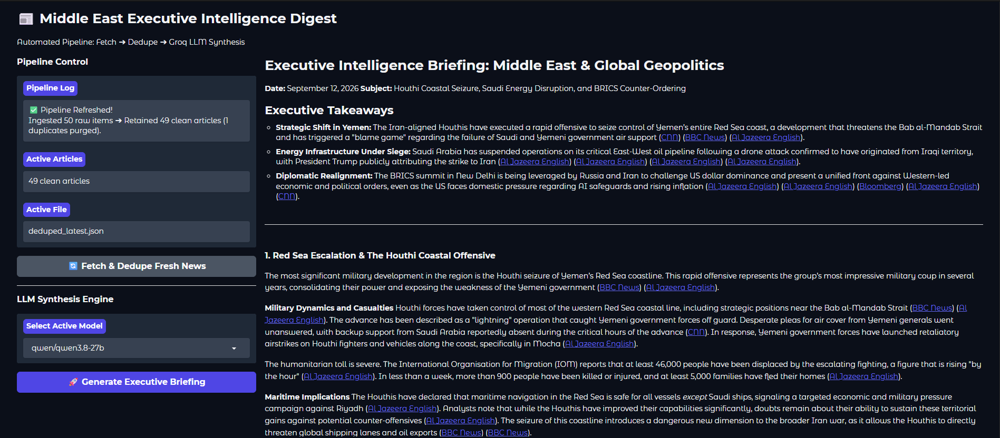

# 📰 Middle East Executive Intelligence Digest

A live news-synthesis pipeline that pulls real-time Middle East coverage from NewsAPI, deduplicates syndicated/liveblog coverage, and uses a Groq-hosted LLM to write a cited, thematically-organized executive briefing — served through an interactive Gradio dashboard.



## What it does

1. **Fetch** — queries NewsAPI's `/v2/everything` endpoint across major outlets (Al Jazeera, BBC, CNN, Reuters, AP, and more) for a configurable set of keywords and time window.
2. **Dedupe** — cleans the raw article set in three passes: exact-URL duplicates, topic-scoped liveblog collapsing (so a single running liveblog does not flood the set), and fuzzy title-similarity matching for syndicated wire stories repeated across outlets.
3. **Digest** — builds a structured, per-article-indexed prompt (`[1]`, `[2]`, ...) and system prompt instructing the model to thematically cluster coverage rather than summarize article-by-article.
4. **Synthesize** — streams a live response from a Groq-hosted model (model list pulled dynamically from Groq's API), then post-processes the model's `[N]`-style citations by substituting in the *real* source URL for article `N` — so every citation is a verified link back to an actual fetched article, not something the model had to type out itself.

All of this runs live from the dashboard: a "Fetch & Dedupe Fresh News" button re-runs the pipeline, and "Generate Executive Briefing" streams the synthesis in real time.

## Architecture


| File | Responsibility |
|---|---|
| `fetch.py` | Talks to NewsAPI, exports raw articles + query metadata to timestamped JSON |
| `dedupe.py` | Exact-URL, liveblog-topic, and fuzzy-title deduplication |
| `digest.py` | Builds the LLM prompt payload; also writes a fallback per-source Markdown report |
| `utils.py` | Shared helpers (safe source-name extraction) |
| `app.py` | Gradio UI — live pipeline control, model selection, streaming synthesis, citation hydration |
| `check_models.py` | Dev utility to list currently available Groq models |

## Tech stack

Python · NewsAPI · Groq Cloud API (OpenAI-compatible SDK) · Gradio · `difflib` (fuzzy dedup) · `python-dotenv`

## Running it locally

```bash
pip install -r requirements.txt
```

Create a `.env` file with:

```
NEWS_API_KEY=your_newsapi_key
GROQAI_API_KEY=your_groq_key
```

Then launch the dashboard:

```bash
python app.py
```

Or run pipeline stages individually from the command line:

```bash
python fetch.py    # pulls fresh articles into data/
python dedupe.py   # cleans the latest raw file
python digest.py   # builds a fallback Markdown report
```

## Known limitations

- **Citation formatting is model-dependent.** Some models emit one citation index per bracket (`[12]`), which hydrates cleanly into a real link; others occasionally bundle several into one bracket (`[10, 23, 33]`), which the current hydration regex does not unpack.
- **Named-entity accuracy is not guaranteed.** Even with correct source grounding, a model can occasionally substitute an outdated or incorrect name (verified during testing: a model cited a real, correctly-linked article about Iran's current president but referred to him by his predecessor's name in the surrounding prose).
- **NewsAPI's free tier caps results at 100 articles per request.** The pipeline detects and logs when a query exceeds that cap, but does not currently paginate to fetch the rest.

## Live demo

Deployed on Hugging Face Spaces — link added once live.
